# Загрузка нужных библеотек

```r
library(dplyr)
```

```
## 
## Присоединяю пакет: 'dplyr'
```

```
## Следующие объекты скрыты от 'package:stats':
## 
##     filter, lag
```

```
## Следующие объекты скрыты от 'package:base':
## 
##     intersect, setdiff, setequal, union
```

```r
library(ggplot2)
library(ggpubr)
library(tidyr)
theme_set(theme_minimal())
```

# 1. Загрузка датасета

```r
ins_cost <- read.csv('insurance_cost.csv') 
str(ins_cost)
```

```
## 'data.frame':	1338 obs. of  7 variables:
##  $ age     : int  19 18 28 33 32 31 46 37 37 60 ...
##  $ sex     : chr  "female" "male" "male" "male" ...
##  $ bmi     : num  27.9 33.8 33 22.7 28.9 ...
##  $ children: int  0 1 3 0 0 0 1 3 2 0 ...
##  $ smoker  : chr  "yes" "no" "no" "no" ...
##  $ region  : chr  "southwest" "southeast" "southeast" "northwest" ...
##  $ charges : num  16885 1726 4449 21984 3867 ...
```

```r
ins_cost$sex <- as.factor(ins_cost$sex)
ins_cost$smoker <- as.factor(ins_cost$smoker)
ins_cost$region <- as.factor(ins_cost$region)
str(ins_cost)
```

```
## 'data.frame':	1338 obs. of  7 variables:
##  $ age     : int  19 18 28 33 32 31 46 37 37 60 ...
##  $ sex     : Factor w/ 2 levels "female","male": 1 2 2 2 2 1 1 1 2 1 ...
##  $ bmi     : num  27.9 33.8 33 22.7 28.9 ...
##  $ children: int  0 1 3 0 0 0 1 3 2 0 ...
##  $ smoker  : Factor w/ 2 levels "no","yes": 2 1 1 1 1 1 1 1 1 1 ...
##  $ region  : Factor w/ 4 levels "northeast","northwest",..: 4 3 3 2 2 3 3 2 1 2 ...
##  $ charges : num  16885 1726 4449 21984 3867 ...
```

# 2. Гистограммы всех нумеричсеких переменных

```r
numeric_vars <- ins_cost %>%
  select_if(is.numeric)

numeric_vars %>%
  gather(key = "var", value = "value") %>%
  ggplot(aes(x = value)) +
  facet_wrap(~var, scales = "free") +
  geom_histogram(bins = 6)
```

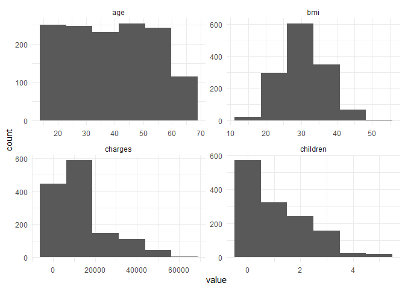<!-- -->

# 3. График плотности по колонке charges

```r
avg <- mean(ins_cost$charges)
median <- median(ins_cost$charges)

den <- ggplot(ins_cost, aes(x=charges)) + 
  geom_density(fill="skyblue", alpha=0.5) +
  geom_vline(aes(xintercept=avg), 
             color="red", linetype="dashed", size=1) +
  geom_vline(aes(xintercept=median), 
             color="blue", linetype="dashed", size=1) +
  annotate("text", x = avg + 7000, y=0.00006, label = paste("Mean =", round(avg, 0)), color="red") +
  annotate("text", x = median + 7000, y=0.00007, label = paste("Median =", round(median, 0)), color="blue") +
  labs(title="Density plot with Mean and Median",
       y="Density",
       x="charges") +
  theme_classic()
```

```
## Warning: Using `size` aesthetic for lines was deprecated in ggplot2 3.4.0.
## ℹ Please use `linewidth` instead.
## This warning is displayed once every 8 hours.
## Call `lifecycle::last_lifecycle_warnings()` to see where this warning was
## generated.
```

```r
den
```

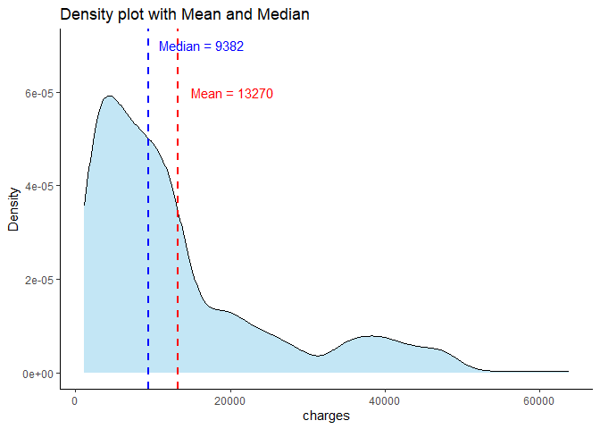<!-- -->
# 4. Три боксплота распределения charges по полу, курению и региону

```r
b_p1 <- ggplot(ins_cost, aes(y=charges, x=sex)) +
  geom_boxplot() +
  labs(x="sex", 
       y="charges") +
  theme_bw()

b_p2 <- ggplot(ins_cost, aes(y=charges, x=smoker)) +
  geom_boxplot() +
  labs(x="smoker", 
       y="charges") +
  theme_bw()

b_p3 <- ggplot(ins_cost, aes(y=charges, x=region)) +
  geom_boxplot() +
  labs(x="region", 
       y="charges") +
  theme_bw()

b_p1
```

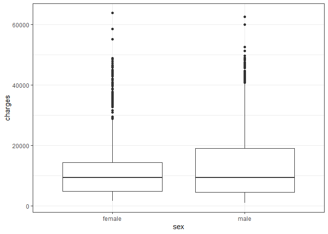<!-- -->

```r
b_p2
```

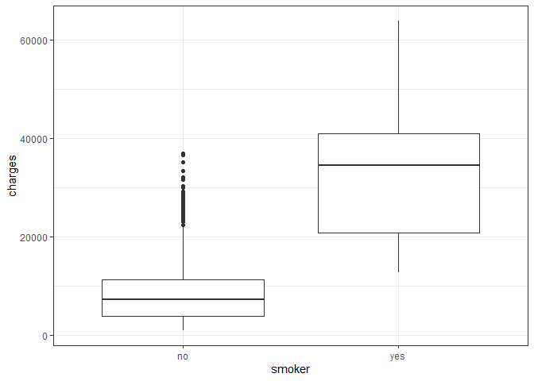<!-- -->

```r
b_p3
```

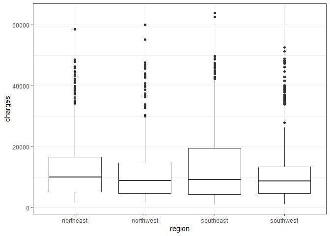<!-- -->

# 5. Объединение графиков из задания 3 и 4 

```r
fig <- ggarrange(den, ggarrange(b_p1, b_p2, b_p3, nrow = 1), nrow = 2) 
annotate_figure(fig, top = text_grob("Charges", size = 20))
```

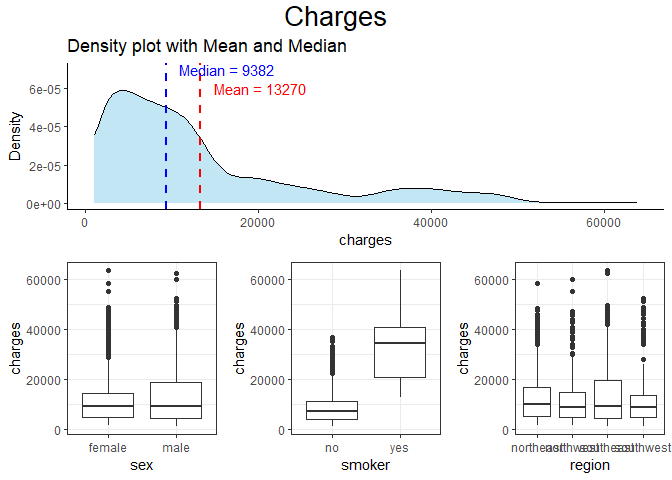<!-- -->

```r
fig
```

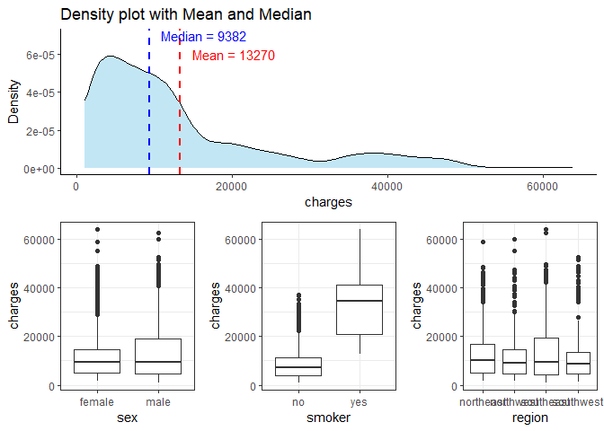<!-- -->

# 6. Фасет графика из задания 3 по колонке region

```r
ggplot(ins_cost, aes(x=charges)) + 
  geom_density(fill="skyblue", alpha=0.5) +
  geom_vline(aes(xintercept=avg), 
             color="red", linetype="dashed", size=1) +
  geom_vline(aes(xintercept=median), 
             color="blue", linetype="dashed", size=1) +
  annotate("text", x = avg + 12000, y=0.00005, label = paste("Mean =", round(avg, 0)), color="red") +
  annotate("text", x = median + 12000, y=0.00006, label = paste("Median =", round(median, 0)), color="blue") +
  labs(title="Density plot with Mean and Median",
       y="Density",
       x="charges") +
  facet_wrap(~region) +
  theme_minimal()
```

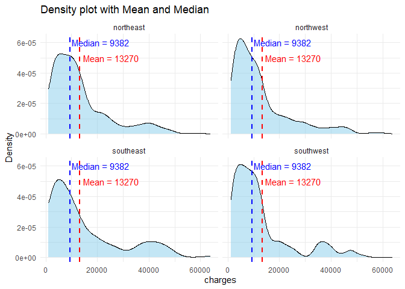<!-- -->

# 7. Скатерплот age vs charges

```r
scatter <- 
  ggplot(ins_cost, aes(x=age, y=charges)) + 
  geom_point(size=2) +
  labs(title="scatter plot",
       y="charges",
       x="age") +
  theme_minimal() +
  theme(axis.text.x = element_text(size = 14))
scatter
```

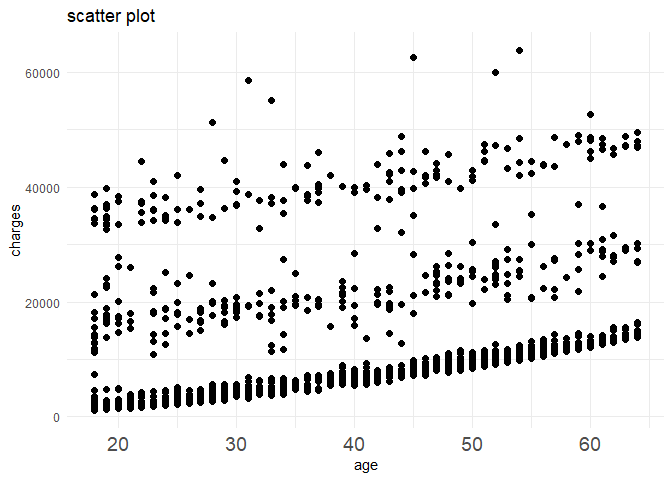<!-- -->

# 8. Добавим линию тренда

```r
scatter2 <- scatter +  
  geom_smooth(method=lm, se=TRUE, color="red") +
  theme(axis.text.x = element_text(size = 14))
scatter2
```

```
## `geom_smooth()` using formula = 'y ~ x'
```

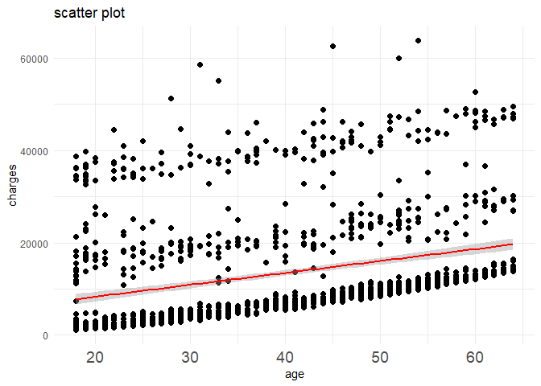<!-- -->

# 9. Две линии тренда для курящих и нет

```r
ggplot(ins_cost, aes(x=age, y=charges, group=smoker, color = smoker)) + 
  geom_point(size=1) +
  labs(title="scatter plot",
       y="charges",
       x="age") +
  theme_minimal() +
  geom_smooth(method=lm, se=TRUE) +
  theme(axis.text.x = element_text(size = 14))
```

```
## `geom_smooth()` using formula = 'y ~ x'
```

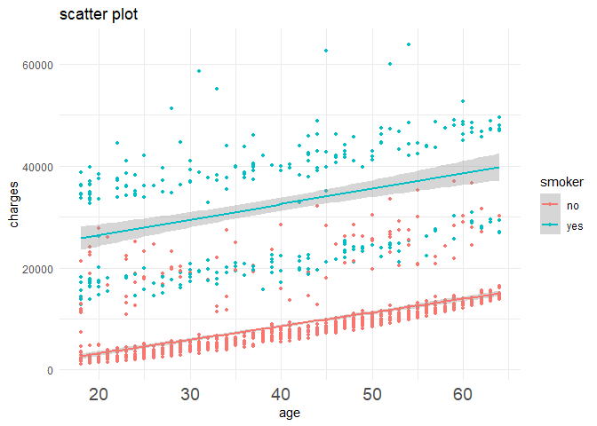<!-- -->
# 10. График из задания 9 но по переменной bmi

```r
ggplot(ins_cost, aes(x=bmi, y=charges, group=smoker, color = smoker)) + 
  geom_point(size=1) +
  labs(title="scatter plot",
       y="charges",
       x="age") +
  theme_minimal() +
  geom_smooth(method=lm, se=TRUE) +
  theme(axis.text.x = element_text(size = 14))
```

```
## `geom_smooth()` using formula = 'y ~ x'
```

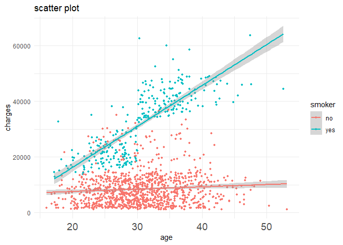<!-- -->

# 11. Вопрос, зависят ли выплаты от возраста и пола с учётом ковариаты курения


```r
ggplot(ins_cost, aes(x=bmi, y=charges, group= sex, color = sex)) + 
  geom_point(size=1) +
  labs(title="scatter plot",
       y="charges",
       x="age") +
  theme_minimal() +
  geom_smooth(method=lm, se=TRUE) +
  theme(axis.text.x = element_text(size = 14)) +
  facet_wrap(~smoker)
```

```
## `geom_smooth()` using formula = 'y ~ x'
```

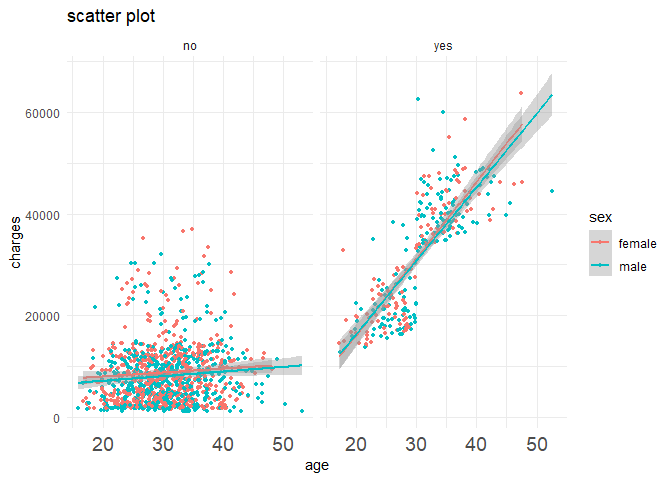<!-- -->

Судя по всему, пол не яляется важной коваритой в объяснении переменной выплаты на фоне факторов возраста и курения

# 14. Довольно точное воспроизведение графика


```r
#ins_cost$log_charges = log(ins_cost$charges)
ins_cost <- ins_cost %>% 
  mutate(
    age_group = case_when(
      age < 34 ~ "age: 21-34",
      age >= 34 & age < 50 ~ "age: 34-49",
      age >= 50 ~ "age: 50+",
    ))

ggplot(ins_cost, aes(x=bmi, y=log(charges), group = age_group)) + 
  geom_point(size=1.6, shape = 21, color = "#4E0077", fill = "#4E0077", alpha = 0.3) +
  labs(title="scatter plot",
       y="log(charges)",
       x="bmi") +
  theme_minimal() +
  geom_smooth(method=lm, se=TRUE, aes(color = age_group)) +
  facet_wrap(~age_group, scales = "fixed") +
  theme_minimal() +
  theme(legend.position = "bottom", panel.grid.major = element_line(colour = "#E1E1E1"), panel.grid.minor = element_line(colour = "#F2F2F2"))
```

```
## `geom_smooth()` using formula = 'y ~ x'
```

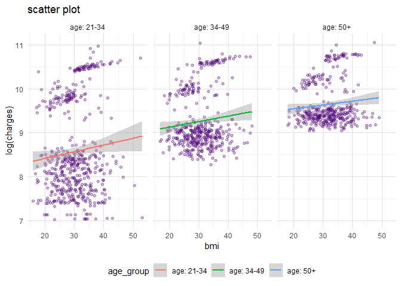<!-- -->


